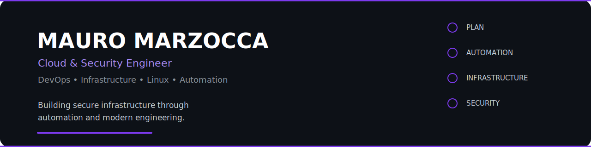

<div align="center">



# Mauro Marzocca

### Cloud & Security Engineer • DevOps • Infrastructure Analyst

<p>

<a href="https://github.com/mauromarzocca">

</a>

<a href="https://www.linkedin.com/in/mauro-marzocca-365193121/">

</a>

<a href="https://mauromarzocca.github.io/portfolio">

</a>

<a href="mailto:YOUR_EMAIL">

</a>

</p>

<p>


</p>

</div>

---

# About

Cloud & Security Engineer with a strong passion for designing reliable infrastructures, automating complex workflows, and building secure, scalable systems.

My professional interests span cloud computing, DevOps, Linux administration, networking, cybersecurity, and infrastructure automation. I enjoy solving operational challenges through clean engineering practices and creating tools that simplify everyday tasks.

I strongly believe that well-designed infrastructure should be secure, observable, maintainable and automated by default.

---

## Current Focus

- Cloud Infrastructure (Azure & AWS)
- DevOps Automation
- Linux Administration
- Infrastructure Monitoring
- Networking
- Security Engineering
- Python & Bash Automation
- Open Source Projects

---

## Engineering Values

| Principle | Description |
|------------|-------------|
| Automation First | Eliminate repetitive work through automation. |
| Security by Design | Integrate security from the beginning, not as an afterthought. |
| Infrastructure as Code | Build reproducible and maintainable environments. |
| Continuous Learning | Stay current with cloud-native technologies and modern engineering practices. |
| Documentation Matters | Good documentation is an integral part of quality software. |
| Reliability over Complexity | Prefer simple, maintainable and resilient solutions. |

---

# Core Expertise

| Domain | Level |
|---------|------|
| Cloud Infrastructure | ██████████ |
| Linux Administration | ██████████ |
| DevOps | █████████ |
| Networking | █████████ |
| Security | █████████ |
| Automation | ██████████ |
| Python | █████████ |
| Bash | █████████ |

---

# Tech Stack

<div align="center">

## Languages

<p>

</p>

## Cloud

<p>

</p>

## DevOps & Infrastructure

<p>

</p>

## Databases

<p>

</p>

## Development Tools

<p>

</p>

</div>

---

# Engineering Toolkit

| Area | Technologies |
|-------|--------------|
| Cloud Platforms | Microsoft Azure • Amazon Web Services |
| Operating Systems | Linux • Ubuntu • Debian |
| Infrastructure | Docker • Virtualization • Networking |
| Automation | Python • Bash • GitHub Actions |
| Monitoring | Logging • Network Monitoring • Automation |
| Security | Cryptography • Hardening • OSINT |
| Version Control | Git • GitHub |
| Productivity | VS Code • Terminal • SSH |

---

# Cloud & Infrastructure Expertise

| Domain | Experience | Focus |
|----------|------------|-------|
| Microsoft Azure | Advanced | Infrastructure & Cloud Administration |
| Amazon Web Services | Advanced | Compute, Storage, Networking |
| Linux | Advanced | System Administration |
| Docker | Advanced | Containerized Applications |
| Networking | Advanced | Routing, Switching, Troubleshooting |
| Infrastructure Automation | Advanced | Python & Bash |
| Security | Advanced | Hardening, Cryptography, Monitoring |

---

# DevOps Workflow

```text
Planning
    │
    ▼
Infrastructure
    │
    ▼
Automation
    │
    ▼
Deployment
    │
    ▼
Monitoring
    │
    ▼
Continuous Improvement
```

---

# Areas of Interest

<table>

<tr>

<td width="50%">

### Cloud Computing

- Azure
- AWS
- Infrastructure Design
- High Availability
- Virtual Machines
- Networking

</td>

<td width="50%">

### DevOps

- Docker
- CI/CD
- GitHub Actions
- Infrastructure Automation
- Linux Administration

</td>

</tr>

<tr>

<td>

### Security

- Cryptography
- Secure Infrastructure
- Network Security
- OSINT
- Monitoring

</td>

<td>

### Automation

- Python
- Bash
- Home Assistant
- Workflow Automation
- Productivity Tools

</td>

</tr>

</table>

---

# Professional Mindset

✔ Build reliable systems

✔ Automate repetitive tasks

✔ Keep infrastructure simple

✔ Design for scalability

✔ Security first

✔ Documentation driven

✔ Open Source mindset

✔ Continuous learning

---

---

# Featured Projects

Each project represents a practical solution to real-world challenges, with a strong focus on automation, infrastructure, networking and security.

<details>
<summary><strong>🌐 NetworkScan</strong> — Network Discovery & Asset Inventory</summary>

### Overview

**NetworkScan** is a Python-based utility designed to quickly discover hosts, identify active devices and simplify network inventory tasks.

| Category | Details |
|-----------|---------|
| **Stack** | Python · Socket · Threading |
| **Platform** | Linux / Windows |
| **Performance** | Fast parallel scanning |
| **Security** | Read-only network discovery |
| **Use Case** | Network inventory & troubleshooting |
| **Repository** | https://github.com/mauromarzocca/NetworkScan |

### Highlights

- Fast host discovery
- Lightweight architecture
- Easy to extend
- Practical for small and medium infrastructures
- Designed with automation in mind

</details>

---

<details>
<summary><strong>🚨 NetworkAllarm</strong> — Network Monitoring & Alerting</summary>

### Overview

A lightweight monitoring solution built to detect connectivity issues and notify administrators when network anomalies occur.

| Category | Details |
|-----------|---------|
| **Stack** | Python |
| **Focus** | Monitoring & Alerting |
| **Reliability** | Continuous monitoring |
| **Security** | Local execution |
| **Impact** | Faster incident detection |
| **Repository** | https://github.com/mauromarzocca/NetworkAllarm |

### Highlights

- Automatic monitoring
- Network availability checks
- Notification support
- Easy deployment
- Infrastructure friendly

</details>

---

<details>
<summary><strong>🔒 Cifratura</strong> — Cryptography Utilities</summary>

### Overview

A collection of educational tools exploring classical cryptography concepts and secure data transformation techniques.

| Category | Details |
|-----------|---------|
| **Domain** | Security |
| **Language** | Python |
| **Purpose** | Educational |
| **Focus** | Cryptography |
| **Repository** | https://github.com/mauromarzocca/Cifratura |

### Highlights

- Encryption algorithms
- Security concepts
- Educational examples
- Modular implementation

</details>

---

<details>
<summary><strong>📅 Shift2Calendar</strong> — Shift Automation</summary>

### Overview

Automation utility that converts work shifts into calendar events, simplifying scheduling and reducing repetitive manual work.

| Category | Details |
|-----------|---------|
| **Language** | Python |
| **Focus** | Automation |
| **Output** | Calendar integration |
| **Repository** | https://github.com/mauromarzocca/Shift2Calendar |

### Highlights

- Productivity automation
- Calendar generation
- Easy configuration
- Time saving

</details>

---

<details>
<summary><strong>📚 CReference</strong> — C Programming Reference</summary>

### Overview

A structured reference repository collecting notes, examples and useful resources for the C programming language.

| Category | Details |
|-----------|---------|
| **Language** | C |
| **Purpose** | Learning |
| **Audience** | Students & Developers |
| **Repository** | https://github.com/mauromarzocca/CReference |

### Highlights

- Well-organized examples
- Language reference
- Educational material
- Continuous updates

</details>

---

<details>
<summary><strong>🎥 yt_downloader</strong> — Media Download Utility</summary>

### Overview

Command-line utility developed to simplify media download workflows while keeping the user experience clean and straightforward.

| Category | Details |
|-----------|---------|
| **Language** | Python |
| **Interface** | CLI |
| **Platform** | Cross-platform |
| **Repository** | https://github.com/mauromarzocca/yt_downloader |

### Highlights

- Simple command-line interface
- Lightweight
- Automation friendly
- Easy maintenance

</details>

---

# Open Source Philosophy

I believe that open source is more than publishing code.

It is about:

- Building reusable solutions.
- Sharing knowledge.
- Encouraging collaboration.
- Improving engineering practices.
- Learning through community feedback.

Whenever possible, I design projects that are simple to understand, easy to maintain and practical to use.

---

---

# Professional Experience

## Cloud & Security Engineer • DevOps • Infrastructure Analyst

Designing and maintaining secure, scalable and automated infrastructures with a strong focus on Linux systems, cloud platforms and operational excellence.

### Areas of Responsibility

- Cloud infrastructure administration (Microsoft Azure & AWS)
- Linux server deployment and maintenance
- Infrastructure automation with Python and Bash
- Network monitoring and troubleshooting
- Security hardening and system monitoring
- DevOps workflows and CI/CD integration
- Documentation and operational best practices

---

# Certifications

<div align="center">

## Microsoft


---

## Cisco


---

## Linux Foundation


</div>

---

# GitHub Analytics

<p align="center">
  
  
</p>

---

# Contribution Activity

<div align="center">


</div>

---

# Contribution Snake

<p align="center">


</p>

---

# Current Focus

```yaml
currently_learning:
  - Kubernetes
  - Infrastructure as Code
  - Advanced Cloud Security

currently_building:
  - Network Automation Tools
  - Infrastructure Monitoring
  - Open Source Utilities

exploring:
  - Cloud Native Technologies
  - AI-assisted Engineering
  - Platform Engineering

open_to:
  - Open Source Collaboration
  - Cloud Engineering
  - DevOps Projects
  - Infrastructure Architecture
```

---

# Connect

<div align="center">

<a href="https://mauromarzocca.github.io/portfolio">

</a>

<a href="https://github.com/mauromarzocca">

</a>

<a href="https://www.linkedin.com/in/mauro-marzocca-365193121/">

</a>

<a href="mailto:YOUR_EMAIL">

</a>

</div>

---

<div align="center">

> *Building secure infrastructure, reliable systems and intelligent automation.*

<br>


</div>
